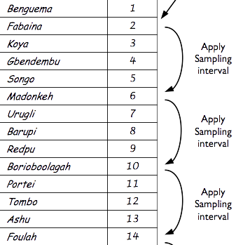
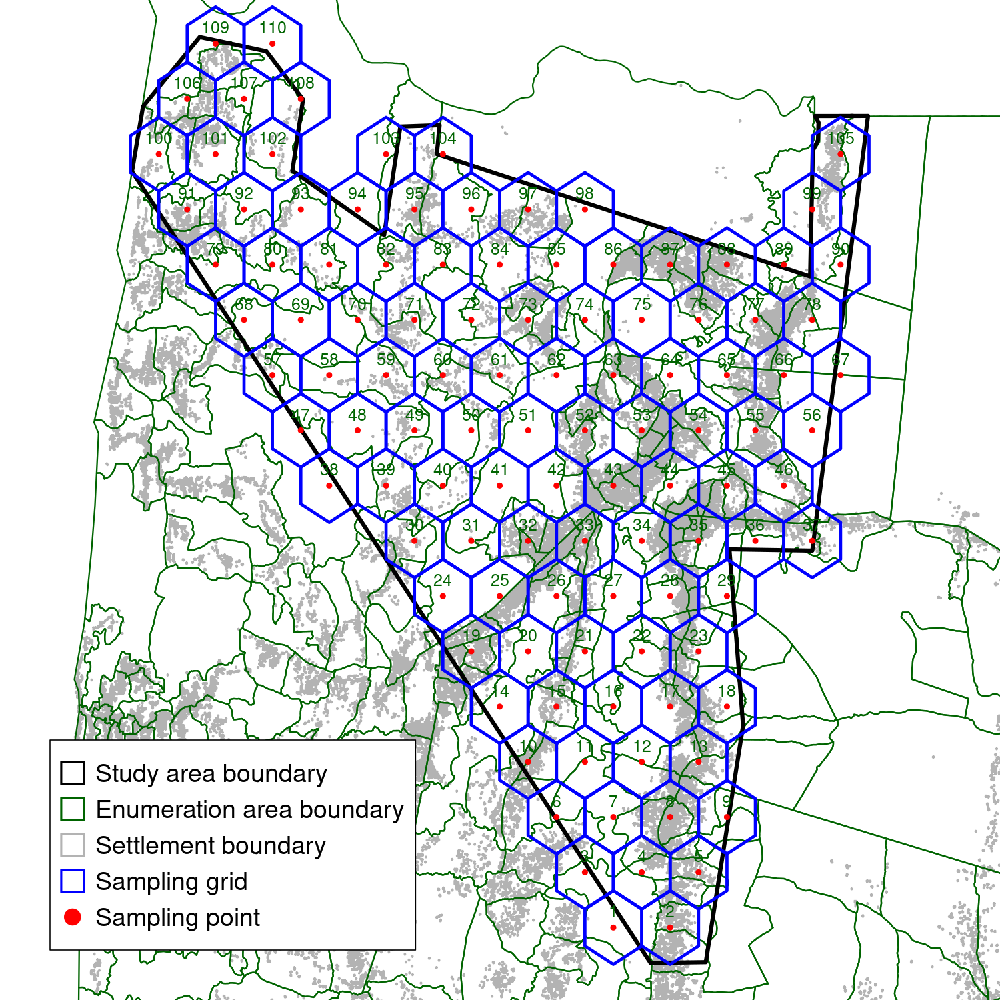
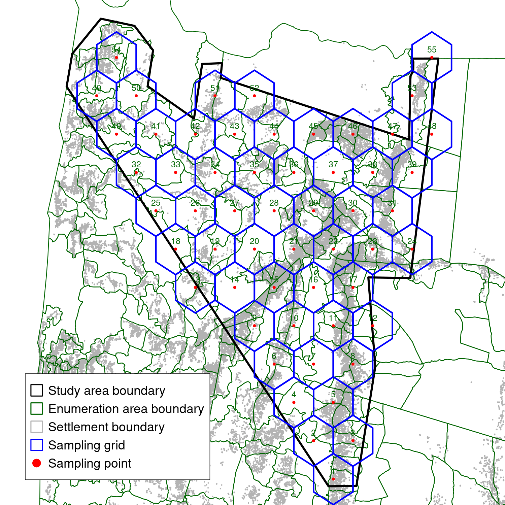

```{r setup, include=FALSE}
options(htmltools.dir.version = FALSE)
```

```{r xaringan-themer, include=FALSE, warning=FALSE}
library(xaringanthemer)
style_mono_light(
  #base_color = "#509935",
  base_color = "#000000",
  base_font_size = "22px",
  title_slide_background_color = "#FFFFFF",
  title_slide_background_image = "images/ecohealth_title_background_4by3.png",
  title_slide_background_size = "contain",
  #title_slide_text_color = "#509935",
  title_slide_text_color = "#000000",
  background_image = "images/ecohealth_slide_background_4by3.png",
  header_font_google = google_font("Fira Sans"),
  text_font_google = google_font("Fira Sans Condensed"),
  code_font_google = google_font("Fira Mono"),
  code_font_size = "0.7rem",
  text_slide_number_font_size = "1em",
  link_color = "#509935"
)
```

## Outline

* Simple sampling

* Complex sampling

* Spatial sampling

---

## Simple sampling

* simple random sample

* systematic sample

---

## Simple sampling: simple random sample

* Drawing a sample of X number from a full list of members of a fixed population.

.pull-left[
Lottery


]

.pull-right[
Random number table


]

---

## Simple sampling: systematic sample

* Determine a **sampling interval**

$$ \text{sampling interval} ~ = ~ \left \lfloor \frac{\text{number of samples needed}}{\text{total number of population}} \right \rfloor $$

* Select a random number from the series of numbers between 1 and the sampling interval. This will be the **random starting point** for the systematic selection.

* Using the **random starting point** and the **sampling interval**, select the samples from a list of all members of the population starting from the random starting point position and then for every successive sampling interval position.

---

## Simple sample: systematic sample

```{r, echo = FALSE, fig.align = "center"}

```

---

class: center, middle

# Complex sample

---

## Complex survey design: two-stage/multi-stage random cluster sample

* First stage sample - sampling of clusters

    * draw a simple random sample of X clusters
    * draw a systematic sample of X clusters
    * draw a sample of X number of clusters selected proportional to population size

* Second stage sample - within-cluster sampling

    * draw a simple random sample of Y members of the selected clusters
    * draw a systematic sample of Y members of the selected clusters
    * draw a spatial sample of Y members of the selected clusters
    
---

## Spatial sampling

* techniques such as Centric Systematic Area Sampling (CSAS) are known to approximate a simple random sample

* useful as an alternative to other sampling approaches particularly when typical sampling frames are not available

---

## Spatial sampling examples - CCHF project

.pull-left[
* no readily available sampling frame

* sample of both households and livestock

* also includes soil samples
]

.pull-right[
 
]

---

## Spatial sampling examples - RVF2 project

.pull-left[

]

.pull-right[

]

---

class: center, middle

# Thank you!

Slides can be viewed at https://ecohealthalliance.github.io/population-sampling or PDF version downloaded at https://ecohealthalliance.github.io/population-sampling/population-sampling.pdf

R scripts for slides available at https://github.com/ecohealthalliance/population-sampling
